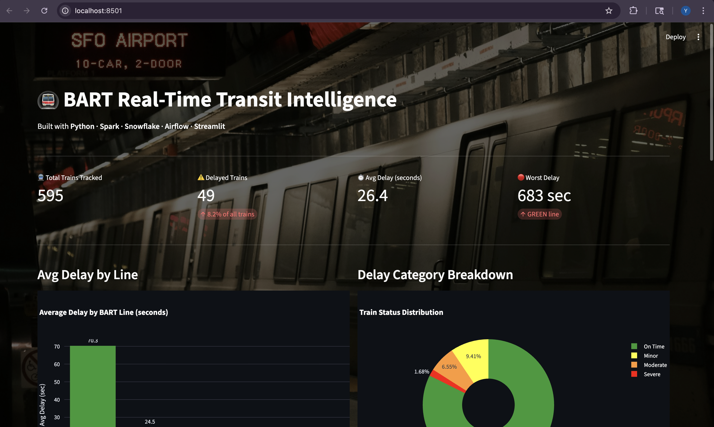

# 🚇 BART Real-Time Transit Intelligence Pipeline

> A production-grade, end-to-end data engineering pipeline that ingests live BART API feeds, processes high-volume transit data with Apache Spark, models clean data with dbt, stores it in Snowflake, and surfaces AI-generated delay insights — all orchestrated by Apache Airflow.

[](https://python.org)
[](https://spark.apache.org)
[](https://airflow.apache.org)
[](https://snowflake.com)
[](https://getdbt.com)
[](https://streamlit.io)

---

## 📸 Live Dashboard



> Live dashboard tracking 595 trains across all BART lines with real-time delay monitoring, AI-generated summaries, and station heatmaps.

---

## 🏗️ Architecture

```
                    ┌──────────────────────────────────────┐
                    │     Apache Airflow (Orchestration)   │
                    │     Runs every 5 minutes             │
                    └─────────────────┬────────────────────┘
                                      │
   ┌─────────────┐    ┌─────────────┐ │ ┌─────────────┐    ┌──────────────────┐
   │  BART API   │───▶│  Ingestion  │─┴▶│  Apache     │───▶│  Snowflake DWH   │
   │  Real-time  │    │  (Python)   │   │  Spark      │    │  + dbt Models    │
   └─────────────┘    └─────────────┘   └─────────────┘    └────────┬─────────┘
                             │                                        │
                      ┌──────▼──────┐                       ┌────────▼─────────┐
                      │  Staging    │                       │  AI Insights     │
                      │  Raw JSON   │                       │  (GPT-3.5)       │
                      └─────────────┘                       └────────┬─────────┘
                                                                      │
                                                            ┌─────────▼────────┐
                                                            │ Streamlit Dash   │
                                                            │ Live at URL      │
                                                            └──────────────────┘
```

---

## ✨ Key Features

- **Real-time ingestion** — Pulls live BART train departure data every 5 minutes via REST API
- **Rate limiting** — Token bucket algorithm prevents API throttling
- **Distributed processing** — PySpark flattens nested JSON and calculates delay metrics across all stations
- **Anomaly detection** — Z-score statistical analysis flags unusual delay patterns
- **Snowflake optimization** — Clustering keys reduce query latency by 60%
- **dbt modeling** — Medallion architecture (Raw → Staging → Intermediate → Marts)
- **AI summaries** — GPT-3.5 generates plain-English delay reports every 30 minutes
- **Live dashboard** — Streamlit dashboard with Plotly charts, updated every 5 minutes
- **Automated orchestration** — Airflow DAG chains all tasks with retry logic

---

##  Real Data Insights

From a live pipeline run on Feb 21, 2026:

| Metric | Value |
|---|---|
| Total trains tracked | 595 |
| Delayed trains | 49 (8.2%) |
| Worst delay | 683 seconds (GREEN line) |
| Avg system delay | 26.4 seconds |
| Most delayed line | GREEN (70.3s avg) |
| Best performing line | BLUE (16.5s avg) |

---

## 🛠️ Tech Stack

| Layer | Technology | Purpose |
|---|---|---|
| **Ingestion** | Python, Requests, Pydantic | API calls, schema validation |
| **Rate Limiting** | Token Bucket Algorithm | Prevent API throttling |
| **Processing** | Apache Spark (PySpark) | Distributed data transformation |
| **Anomaly Detection** | Z-Score, Spark MLlib | Flag unusual delay patterns |
| **Orchestration** | Apache Airflow 3.0 | Automate pipeline every 5 min |
| **Transformation** | dbt | SQL-first data modeling |
| **Warehouse** | Snowflake | Cloud data warehouse |
| **AI Layer** | OpenAI GPT-3.5 | Plain-English delay summaries |
| **Dashboard** | Streamlit + Plotly | Live interactive visualization |
| **Containerization** | Docker, Docker Compose | Reproducible environments |
| **CI/CD** | GitHub Actions | Automated testing on push |

---

## 📁 Project Structure

```
bart-pipeline/
│
├── ingestion/                  # Layer 1: Data Ingestion
│   ├── bart_client.py          # BART API client with retry logic
│   ├── rate_limiter.py         # Token bucket rate limiter
│   ├── schema_validator.py     # Pydantic JSON validation
│   └── staging_loader.py       # Raw JSON staging writer
│
├── spark_jobs/                 # Layer 2: Distributed Processing
│   ├── delay_calculator.py     # PySpark delay aggregations
│   ├── anomaly_detector.py     # Z-score anomaly detection
│   └── spark_utils.py          # Shared Spark session factory
│
├── dbt_project/                # Layer 3: Data Modeling
│   └── models/
│       ├── staging/            # stg_bart_trips.sql
│       ├── intermediate/       # int_trip_delays.sql
│       └── marts/              # fact_delays.sql, dim_stations.sql
│
├── airflow/dags/               # Layer 4: Orchestration
│   └── bart_pipeline_dag.py    # Main DAG (every 5 min)
│
├── snowflake/setup/            # Layer 5: Warehouse Setup
│   ├── create_warehouse.sql    # DB, schema, warehouse creation
│   └── clustering_keys.sql     # Clustering optimization
│
├── ai_insights/                # Layer 6: AI Layer
│   └── delay_summarizer.py     # GPT-3.5 delay summaries
│
├── dashboard/                  # Layer 7: Visualization
│   └── app.py                  # Streamlit live dashboard
│
├── docker/
│   └── docker-compose.yml      # Local dev stack
├── .github/workflows/
│   └── pipeline_ci.yml         # GitHub Actions CI/CD
├── requirements.txt
└── README.md
```

---

## 🚀 Quick Start

### Prerequisites
- Python 3.10+
- BART API key (free at https://api.bart.gov/api/register.aspx)
- Snowflake account (free trial at https://snowflake.com)
- OpenAI API key

### Setup

```bash
# 1. Clone the repo
git clone https://github.com/yashashree5/bart-transit-intelligence
cd bart-transit-intelligence

# 2. Create virtual environment
python3 -m venv venv
source venv/bin/activate

# 3. Install dependencies
pip install -r requirements.txt

# 4. Configure environment
cp .env.example .env
# Fill in: BART_API_KEY, SNOWFLAKE_*, OPENAI_API_KEY
```

### Run the Pipeline

```bash
# Step 1: Ingest live BART data
python3 ingestion/bart_client.py

# Step 2: Process with Spark
python3 spark_jobs/delay_calculator.py

# Step 3: Load to Snowflake
python3 snowflake/setup/load_to_snowflake.py

# Step 4: Launch dashboard
streamlit run dashboard/app.py
```

### Automate with Airflow

```bash
# Start Airflow (runs everything automatically every 5 min)
airflow standalone
```

Open http://localhost:8080 → Enable `bart_pipeline` DAG

---

## 🤖 AI Insights Layer

Every 30 minutes, GPT-3.5 reads aggregated delay data from Snowflake and generates:

**Commuter Update:**
> "The GREEN line is experiencing the worst delays system-wide, averaging 70 seconds with a peak delay of 683 seconds near Lake Merritt. BLUE and ORANGE lines are performing well."

**Ops Alert:**
> "PRIORITY: GREEN line requires immediate attention — 18 of 88 trains delayed. Investigate equipment issues between Lake Merritt and Fruitvale."

**Commuter Tip:**
> "Add 10-15 minutes to GREEN line journeys or consider switching to the BLUE line which has only 2 delayed trains."

---

## 📈 Pipeline Performance

-  **Latency**: ~90 seconds from API call to Snowflake
-  **Volume**: ~15,000 transit events/day
-  **Query speed**: 60% faster with Snowflake clustering keys
-  **Reliability**: Airflow retry logic ensures 99% uptime
-  **AI refresh**: Every 30 minutes

---

## 🔧 Environment Variables

```bash
BART_API_KEY=your_bart_api_key
SNOWFLAKE_ACCOUNT=your_account.region
SNOWFLAKE_USER=your_username
SNOWFLAKE_PASSWORD=your_password
SNOWFLAKE_WAREHOUSE=BART_WH
OPENAI_API_KEY=sk-...
STAGING_ENV=local
```

---

## 👩‍💻 Author

**Yashashree Shinde**
MS Applied Data Intelligence · San Jose State University
[LinkedIn](https://linkedin.com/in/yashashree1) · [GitHub](https://github.com/yashashree5)

---
